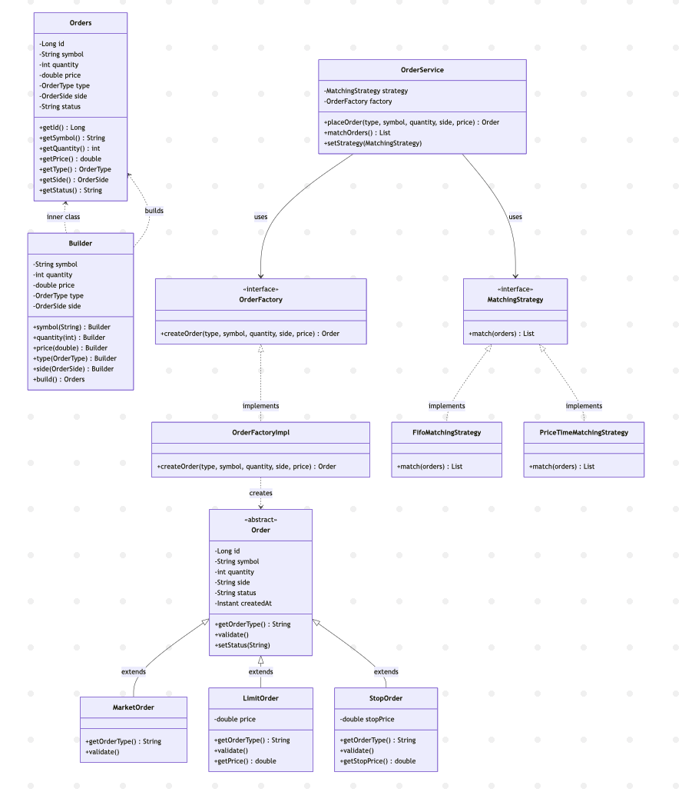
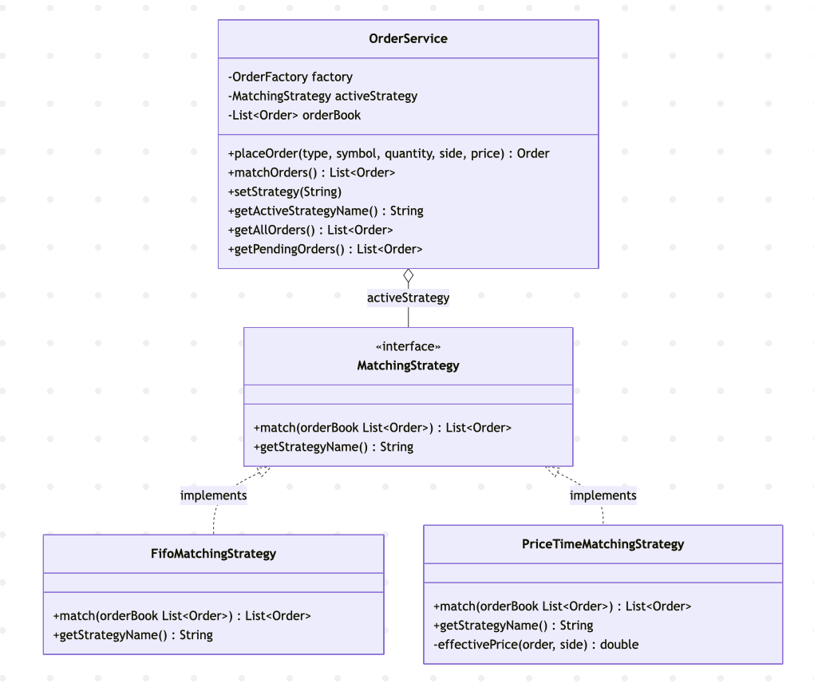

# Trading Order Management System

A Java-based Order Management System (OMS) simulating core stock trading
functionality. Built with Spring Boot and OOP Design Patterns.

## Tech Stack

- Java 21
- Spring Boot 3
- Spring Data JPA / H2 (in-memory database)
- OOP Design Patterns

## Architecture

```
OrderController → OrderService → OrderFactory (Factory Pattern)
                              → MatchingStrategy (Strategy Pattern)
```

## Design Patterns

### Factory Pattern — Order Creation

The `OrderFactory` creates the correct order subclass based on a type string.
Callers never reference concrete classes (`MarketOrder`, `LimitOrder`, `StopOrder`) directly.

<p align="center">
  
</p>

### Strategy Pattern — Order Matching

The `MatchingStrategy` interface allows the matching algorithm to be swapped at
runtime without changing any other class. Two implementations are provided:
`FifoMatchingStrategy` and `PriceTimeMatchingStrategy`.

<p align="center">
  
</p>

## API Endpoints

| Method | Path | Description |
|--------|------|-------------|
| `POST` | `/orders` | Place a new order (MARKET, LIMIT, or STOP) |
| `GET` | `/orders` | List all orders |
| `GET` | `/orders/pending` | List pending orders only |
| `POST` | `/orders/match` | Run the active matching strategy |
| `GET` | `/orders/strategy` | Get the active matching strategy |
| `PUT` | `/orders/strategy` | Swap the matching strategy at runtime |

### Example — Place a Limit Order

```json
POST /orders
{
  "type":     "LIMIT",
  "symbol":   "AAPL",
  "quantity": 100,
  "side":     "BUY",
  "price":    185.50
}
```

### Example — Switch Matching Strategy

```json
PUT /orders/strategy
{
  "strategy": "PRICE_TIME"
}
```
