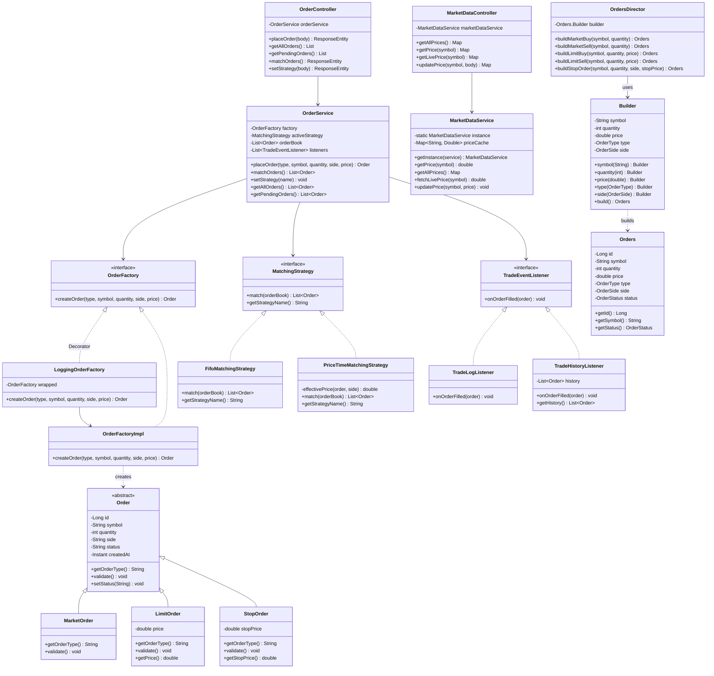

# Trading Order Management System

A Java-based Order Management System (OMS) simulating core stock trading
functionality. Built with Spring Boot and OOP Design Patterns.

## Tech Stack

- Java 21
- Spring Boot 3
- Spring Data JPA / H2 (in-memory database)

## Architecture

    OrderController → OrderService → LoggingOrderFactory (Decorator)
                                           ↓
                                   OrderFactoryImpl (Factory)
                                           ↓
                                   Order subclasses (Product)

    OrderService → MatchingStrategy (Strategy)
                → TradeEventListener[] (Observer)
                → MarketDataService (Singleton)

    OrdersDirector → Orders.Builder (Builder)

## Design Patterns

### 1. Factory Pattern — Order Creation

`OrderFactory` interface is implemented by `OrderFactoryImpl`, which creates
the correct order subclass (`MarketOrder`, `LimitOrder`, `StopOrder`) based
on a type string. Callers never reference concrete classes directly.

### 2. Strategy Pattern — Order Matching

`MatchingStrategy` interface allows the matching algorithm to be swapped at
runtime without changing any other class.

Implementations:
- `FifoMatchingStrategy` — match in strict arrival order
- `PriceTimeMatchingStrategy` — match by best price first, then arrival time

### 3. Builder Pattern — Order Construction

`Orders.Builder` constructs order objects step by step with validation.
`OrdersDirector` encapsulates named construction recipes like `buildMarketBuy()`
and `buildLimitSell()` so callers never chain the builder manually.

### 4. Observer Pattern — Trade Event Notifications

`TradeEventListener` interface is implemented by two concrete listeners:
- `TradeLogListener` — prints filled order details to the console
- `TradeHistoryListener` — maintains an in-memory list of all filled orders

Both are automatically notified by `OrderService` whenever `matchOrders()` fills an order.

### 5. Singleton Pattern — Market Data Service

`MarketDataService` is a Spring-managed singleton that holds a single shared
price cache across the entire application. `getInstance()` enforces that only
one instance is ever used regardless of how many classes request it.

### 6. Decorator Pattern — Logging Order Factory

`LoggingOrderFactory` wraps `OrderFactoryImpl` and adds console logging before
and after every order creation without modifying the original factory code.
Marked `@Primary` so Spring injects it automatically wherever `OrderFactory` is needed.

## API Endpoints

### Orders

| Method | Path | Description |
|--------|------|-------------|
| `POST` | `/orders` | Place a new order (MARKET, LIMIT, or STOP) |
| `GET` | `/orders` | List all orders |
| `GET` | `/orders/pending` | List pending orders only |
| `POST` | `/orders/match` | Run the active matching strategy |
| `GET` | `/orders/strategy` | Get the active matching strategy |
| `PUT` | `/orders/strategy` | Swap the matching strategy at runtime |

### Market Data

| Method | Path | Description |
|--------|------|-------------|
| `GET` | `/market/prices` | Get all cached symbol prices |
| `GET` | `/market/price/{symbol}` | Get price for a specific symbol |
| `PUT` | `/market/price/{symbol}` | Update price for a specific symbol |

## Example Requests

### Place a Market Order

```json
POST /orders
{
  "type":     "MARKET",
  "symbol":   "AAPL",
  "quantity": 100,
  "side":     "BUY"
}
```

### Place a Limit Order

```json
POST /orders
{
  "type":     "LIMIT",
  "symbol":   "AAPL",
  "quantity": 100,
  "side":     "BUY",
  "price":    185.50
}
```

### Switch Matching Strategy

```json
PUT /orders/strategy
{
  "strategy": "PRICE_TIME"
}
```

### Update a Market Price

```json
PUT /market/price/AAPL
{
  "price": 192.75
}
```

## How to Run

```
mvn spring-boot:run
```

Requires Java 21. No external database setup needed — uses H2 in-memory database.

## Final Submission Plan

The demo will walk through:
1. Placing a market order and a limit order via the API
2. Running the matching engine and showing filled orders in the console log (Observer + Decorator output visible)
3. Switching the matching strategy at runtime from FIFO to PRICE_TIME
4. Querying live market prices from the MarketDataService

## Known Issues

- Docker not included. Run locally with `mvn spring-boot:run` and Java 21.
- `OrdersDirector` and `Orders.Builder` operate independently of the main order flow — they demonstrate the Builder pattern as a standalone construction mechanism.
- H2 database resets on every restart — order book is in-memory only.
- Market prices are seeded with static values; no live ex# Trading Order Management System

A Java-based Order Management System (OMS) simulating core stock trading
functionality. Built with Spring Boot and OOP Design Patterns.

## Tech Stack

- Java 21
- Spring Boot 3
- Spring Data JPA / H2 (in-memory database)

## Architecture

    OrderController → OrderService → LoggingOrderFactory (Decorator)
                                           ↓
                                   OrderFactoryImpl (Factory)
                                           ↓
                                   Order subclasses (Product)

    OrderService → MatchingStrategy (Strategy)
                → TradeEventListener[] (Observer)
                → MarketDataService (Singleton)

    OrdersDirector → Orders.Builder (Builder)

## UML Diagram


```mermaid
classDiagram
    direction TB

    class OrderController {
        -OrderService orderService
        +placeOrder(body) ResponseEntity
        +getAllOrders() List
        +getPendingOrders() List
        +matchOrders() ResponseEntity
        +setStrategy(body) ResponseEntity
    }

    class OrderService {
        -OrderFactory factory
        -MatchingStrategy activeStrategy
        -List~Order~ orderBook
        -List~TradeEventListener~ listeners
        +placeOrder(type, symbol, quantity, side, price) Order
        +matchOrders() List~Order~
        +setStrategy(name) void
        +getAllOrders() List~Order~
        +getPendingOrders() List~Order~
    }

    class OrderFactory {
        <<interface>>
        +createOrder(type, symbol, quantity, side, price) Order
    }

    class LoggingOrderFactory {
        -OrderFactory wrapped
        +createOrder(type, symbol, quantity, side, price) Order
    }

    class OrderFactoryImpl {
        +createOrder(type, symbol, quantity, side, price) Order
    }

    class Order {
        <<abstract>>
        -Long id
        -String symbol
        -int quantity
        -String side
        -String status
        -Instant createdAt
        +getOrderType() String
        +validate() void
        +setStatus(String) void
    }

    class MarketOrder {
        +getOrderType() String
        +validate() void
    }

    class LimitOrder {
        -double price
        +getOrderType() String
        +validate() void
        +getPrice() double
    }

    class StopOrder {
        -double stopPrice
        +getOrderType() String
        +validate() void
        +getStopPrice() double
    }

    class MatchingStrategy {
        <<interface>>
        +match(orderBook) List~Order~
        +getStrategyName() String
    }

    class FifoMatchingStrategy {
        +match(orderBook) List~Order~
        +getStrategyName() String
    }

    class PriceTimeMatchingStrategy {
        -effectivePrice(order, side) double
        +match(orderBook) List~Order~
        +getStrategyName() String
    }

    class TradeEventListener {
        <<interface>>
        +onOrderFilled(order) void
    }

    class TradeLogListener {
        +onOrderFilled(order) void
    }

    class TradeHistoryListener {
        -List~Order~ history
        +onOrderFilled(order) void
        +getHistory() List~Order~
    }

    class MarketDataService {
        -static MarketDataService instance
        -Map~String, Double~ priceCache
        +getInstance(service) MarketDataService
        +getPrice(symbol) double
        +getAllPrices() Map
        +fetchLivePrice(symbol) double
        +updatePrice(symbol, price) void
    }

    class MarketDataController {
        -MarketDataService marketDataService
        +getAllPrices() Map
        +getPrice(symbol) Map
        +getLivePrice(symbol) Map
        +updatePrice(symbol, body) Map
    }

    class Orders {
        -Long id
        -String symbol
        -int quantity
        -double price
        -OrderType type
        -OrderSide side
        -OrderStatus status
        +getId() Long
        +getSymbol() String
        +getStatus() OrderStatus
    }

    class Builder {
        -String symbol
        -int quantity
        -double price
        -OrderType type
        -OrderSide side
        +symbol(String) Builder
        +quantity(int) Builder
        +price(double) Builder
        +type(OrderType) Builder
        +side(OrderSide) Builder
        +build() Orders
    }

    class OrdersDirector {
        -Orders.Builder builder
        +buildMarketBuy(symbol, quantity) Orders
        +buildMarketSell(symbol, quantity) Orders
        +buildLimitBuy(symbol, quantity, price) Orders
        +buildLimitSell(symbol, quantity, price) Orders
        +buildStopOrder(symbol, quantity, side, stopPrice) Orders
    }

    OrderController --> OrderService
    OrderService --> OrderFactory
    OrderService --> MatchingStrategy
    OrderService --> TradeEventListener
    OrderFactory <|.. LoggingOrderFactory : Decorator
    OrderFactory <|.. OrderFactoryImpl
    LoggingOrderFactory --> OrderFactoryImpl
    OrderFactoryImpl ..> Order : creates
    Order <|-- MarketOrder
    Order <|-- LimitOrder
    Order <|-- StopOrder
    MatchingStrategy <|.. FifoMatchingStrategy
    MatchingStrategy <|.. PriceTimeMatchingStrategy
    TradeEventListener <|.. TradeLogListener
    TradeEventListener <|.. TradeHistoryListener
    MarketDataController --> MarketDataService
    OrdersDirector --> Builder : uses
    Builder ..> Orders : builds
```

## Design Patterns

### 1. Factory Pattern — Order Creation

`OrderFactory` interface is implemented by `OrderFactoryImpl`, which creates
the correct order subclass (`MarketOrder`, `LimitOrder`, `StopOrder`) based
on a type string. Callers never reference concrete classes directly.

### 2. Strategy Pattern — Order Matching

`MatchingStrategy` interface allows the matching algorithm to be swapped at
runtime without changing any other class.

Implementations:
- `FifoMatchingStrategy` — match in strict arrival order
- `PriceTimeMatchingStrategy` — match by best price first, then arrival time

### 3. Builder Pattern — Order Construction

`Orders.Builder` constructs order objects step by step with validation.
`OrdersDirector` encapsulates named construction recipes like `buildMarketBuy()`
and `buildLimitSell()` so callers never chain the builder manually.

### 4. Observer Pattern — Trade Event Notifications

`TradeEventListener` interface is implemented by two concrete listeners:
- `TradeLogListener` — prints filled order details to the console
- `TradeHistoryListener` — maintains an in-memory list of all filled orders

Both are automatically notified by `OrderService` whenever `matchOrders()` fills an order.

### 5. Singleton Pattern — Market Data Service

`MarketDataService` is a Spring-managed singleton that holds a single shared
price cache across the entire application. `getInstance()` enforces that only
one instance is ever used regardless of how many classes request it.

### 6. Decorator Pattern — Logging Order Factory

`LoggingOrderFactory` wraps `OrderFactoryImpl` and adds console logging before
and after every order creation without modifying the original factory code.
Marked `@Primary` so Spring injects it automatically wherever `OrderFactory` is needed.

## UI

A trading terminal UI is served at `http://localhost:8080` automatically when
the application starts. No separate frontend setup required.

Features:
- Place MARKET, LIMIT, and STOP orders via a form
- Live order book table showing all orders and their statuses
- Pending orders tab showing unmatched orders only
- Run the matching engine with one click and see results immediately
- Switch between FIFO and PRICE_TIME strategies at runtime
- Market Prices tab showing live prices for 20 symbols fetched from Yahoo Finance
- Ticker strip in the header updating with real market data

Supported symbols: AAPL, MSFT, TSLA, GOOGL, AMZN, META, NVDA, JPM, GS, NFLX,
AMD, INTC, UBER, SHOP, COIN, BA, DIS, PYPL, SNAP, SPOT

## API Endpoints

### Orders

| Method | Path | Description |
|--------|------|-------------|
| `POST` | `/orders` | Place a new order (MARKET, LIMIT, or STOP) |
| `GET` | `/orders` | List all orders |
| `GET` | `/orders/pending` | List pending orders only |
| `POST` | `/orders/match` | Run the active matching strategy |
| `GET` | `/orders/strategy` | Get the active matching strategy |
| `PUT` | `/orders/strategy` | Swap the matching strategy at runtime |

### Market Data

| Method | Path | Description |
|--------|------|-------------|
| `GET` | `/market/prices` | Get all cached symbol prices |
| `GET` | `/market/price/{symbol}` | Get price for a specific symbol |
| `GET` | `/market/live/{symbol}` | Fetch live price from Yahoo Finance |
| `PUT` | `/market/price/{symbol}` | Update price for a specific symbol |

## Example Requests

### Place a Market Order

```json
POST /orders
{
  "type":     "MARKET",
  "symbol":   "AAPL",
  "quantity": 100,
  "side":     "BUY"
}
```

### Place a Limit Order

```json
POST /orders
{
  "type":     "LIMIT",
  "symbol":   "AAPL",
  "quantity": 100,
  "side":     "BUY",
  "price":    185.50
}
```

### Switch Matching Strategy

```json
PUT /orders/strategy
{
  "strategy": "PRICE_TIME"
}
```

### Update a Market Price

```json
PUT /market/price/AAPL
{
  "price": 192.75
}
```

## How to Run

```
mvn spring-boot:run
```

Requires Java 21. No external database setup needed — uses H2 in-memory database.
Once running, open `http://localhost:8080` in your browser for the trading terminal UI.

## Final Submission Plan

The demo will walk through:
1. Opening the UI at `http://localhost:8080`
2. Placing a market order and a limit order via the order form
3. Running the matching engine — showing FILLED orders and Observer/Decorator output in the console
4. Switching the strategy from FIFO to PRICE_TIME at runtime
5. Viewing live market prices for 20 symbols in the Market Prices tab

## Implementation Notes

- Builder pattern (`Orders` / `OrdersDirector`) operates as a standalone
  construction mechanism separate from the main order flow, which uses the
  Factory pattern for runtime order creation.
- Singleton enforcement is layered: Spring manages one instance by default,
  and `getInstance()` adds an explicit guard on top.
- Decorator (`LoggingOrderFactory`) is injected via `@Primary` so no changes
  were needed in `OrderService` to activate it.

## Known Issues

- Docker not included. Run locally with `mvn spring-boot:run` and Java 21.
- `OrdersDirector` and `Orders.Builder` operate independently of the main order
  flow — they demonstrate the Builder pattern as a standalone construction mechanism.
- H2 database resets on every restart — order book is in-memory only.
- Live prices fetched from Yahoo Finance via RestTemplate with static seed
  fallback if the request fails.ternal feed is connected.